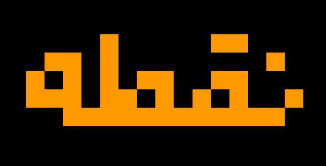
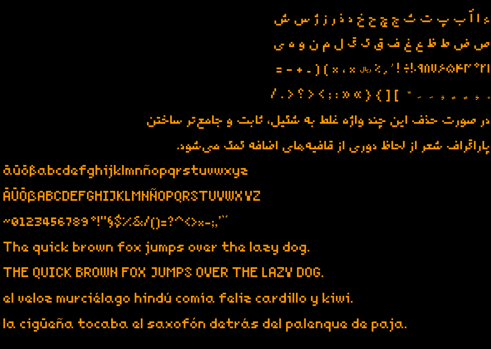

# Noqte
A fun, minimalistic Persian pixel font - WIP.

## Introduction
I made this font in a week from scratch in order to use it in my game. The em-height is 1024 points. Each glyph is made of 64x64 points squares. There are some exceptions, sadly, mainly for designing diacritics. Those might be removed in a final version, however. For those at moment another square size is used which is 75% smaller, i.e. 32x32 points.

I have made a few design choices and tried to remain consistent as much as possible:
- There is no left bearing anywhere
- All initial glyphs have one block right bearing (64 points empty space to the right)
- Important: medial forms have no bearing to the right. I assumed that other initial or medial glyph should consider this and add blocks to the left if necessary
- The bottom left block on each initial glyph is empty
- The bottom left block on each medial glyph is full

There might be some minor divergences, which is either a bug and should be fixed or is due to diacritics.

## Features
The font covers main charachters for Persian from the following Unicode blocks:
- Arabic (0600–06FF)
- Arabic Presentation Forms-A (FB50–FDFF)
- Arabic Presentation Forms-B (FE70–FEFF)
- Basic Latin (ASCII) - letters missing

## Glyphs
Here is a subset of glyphs.

## Building
Install FontForge then build either using FontForge or the Makefile:

	$ make

A font file should be generated in the same folder called `noqte.ttf`.

## Bugs
Please report them on the repository or email me. The following problems are known to me:

- There is no kerning
- There are no anchors
- Diacritics are not well-positioned

## Aknowledgement
Credit when credit is due. I benefited from the work of others mentioned below.

- Typography by Farshid Mesghali (تایپوگرافی اثر فرشید مثقالی): on Persian typography
- [FontForge](https://fontforge.org/): I designed everything in it
- [Design with FontForge](http://designwithfontforge.com): the FontForge book
- [pixeldroid Console](https://github.com/pixeldroid/fonts/tree/master/console): learned from their design choices
- [شروع با FontForge](http://rastikerdar.github.io/getting-started-with-fontforge/): helped me to get started with FontForge
- [How To Make a Snap-to Grid In FontForge](https://namethattech.wordpress.com/2017/03/22/how-to-make-a-snap-to-grid-in-fontforge/): helped me to make a grid of my own

# License
Noqte is released under the [OFL license](LICENSE).
Copyright (C) 2022 Mehdi Sadeghi